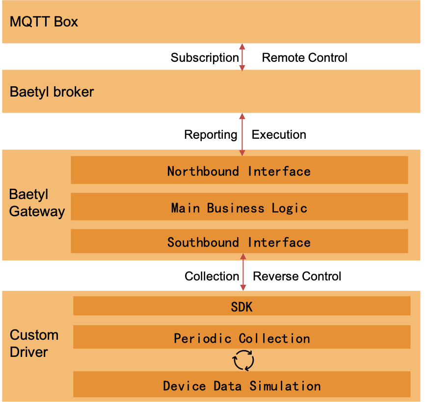

# BAETYL GATEWAY SDK
[](https://baetyl.io)

[](LICENSE)
[](Stars)

[中文](./README_zh.md)

Baetyl-Gateway is a BIE software gateway implemented based on the open-source framework [go-plugin](https://github.com/hashicorp/go-plugin).

Aimed at addressing the challenge of unifying data access from massive heterogeneous devices in the industrial IoT domain, this framework is dedicated to converting data from various device communication protocols into a consistent IoT standard protocol. This ensures connectivity between devices and IoT systems, providing comprehensive data support for industrial production and manufacturing processes.

## Architecture


### baetyl-gateway-sdk
baetyl-gateway-sdk is responsible for encapsulating the basic communication between specific drivers and the baetyl-gateway main process.

It corresponds to the blue dashed box in the architecture diagram.

The SDK mainly provides the following three functions:
* During the implementation of the driver protocol, the interfaces of the corresponding language SDK can be called to complete data reporting and synchronization.
* By implementing the predefined interfaces of the SDK, the driver can be hosted to the baetyl-gateway main process, which will handle the start and stop operations of the driver.
* Provides encapsulation logic for parsing the three configuration files of the baetyl-gateway framework: access_template.yml, models.yml, sub_devices.yml.

## Directory Structure

```
.
├── LICENSE
├── README.md
├── demo
│   ├── java
│   ├── golang
│   ├── python
│   ├── csharp
│   └── java
├── docs
├── sdk
│   ├── README.md
│   ├── example
│   ├── java
│   ├── golang
│   ├── python
│   ├── csharp
│   └── proto
└── test
    ├── baetyl-broker
    ├── baetyl-gateway
    └── driver
        ├── custom-java
        ├── custom-golang
        ├── custom-python
        └── custom-csharp
```

./sdk
* sdk/README.md: General SDK development guide
* sdk/{language}: Contains the implementation of SDKs in specific languages (java, golang, python, csharp)
* sdk/proto: Defines the list of RPC functions supported by the soft gateway host service and driver service. Specific function definitions will be introduced below.
* sdk/example: Provides examples of the three configuration files ultimately provided to the driver under the baetyl-gateway framework. Specific example contents will be introduced below.

./demo
* demo/{language}: Contains the implementation of a custom driver based on the corresponding language SDK (java, golang, python, csharp). The demo implements the process of collecting and reporting data from three simulated points.

./test
* test/baetyl-broker: Contains a binary program for a small MQTT Broker implementation, used to assist in the development and debugging of the driver. Specific files can be found in the v0.0.0 Pre Release [baetyl-broker.tgz](https://github.com/baetyl/baetyl-gateway-sdk/releases/download/v0.0.0/baetyl-broker.tgz).
* test/baetyl-gateway: Contains the binary program for the baetyl soft gateway, used to assist in the development and debugging of the driver. Specific files can be found in the v0.0.0 Pre Release [baetyl-gateway.tgz](https://github.com/baetyl/baetyl-gateway-sdk/releases/download/v0.0.0/baetyl-gateway.tgz).
* test/driver/custom-{language}: Provides configuration files for running custom language demo binaries. These can be used in conjunction with the above tools to run the soft gateway and developed drivers.

## SDK Development
The project provides SDK implementations in several languages:

* [Golang SDK](./sdk/golang)
* [Java SDK](./sdk/java)
* [Python SDK](./sdk/python)
* [C# SDK](./sdk/csharp)

Notes:
* Source code can be viewed in the corresponding directory of the project.
* The releases also provide the outputs corresponding to each language SDK. These can be directly included and used according to the dependency method of each language. Specific output files and usage methods can be found in the README.md of each language SDK directory.

If you need to implement an SDK from scratch, you can refer to the instructions in [sdk/README.md](./sdk/README.md).

## Custom Driver Development
The project provides custom driver protocol implementations based on the above SDKs:

* [Golang Demo](./demo/golang)
* [Java Demo](./demo/java)
* [Python Demo](./demo/python)
* [C# Demo](./demo/csharp)

Notes:
* Source code can be viewed in the corresponding directory of the project.
* The releases also provide the outputs corresponding to each language demo. These can be directly tested and used. Specific output files and usage methods can be found in the README.md of each language SDK directory.

If you need to implement a protocol yourself, you can refer to the instructions in [demo/README.md](./demo/README.md).

## Running
Referring to the architecture described earlier, a specific driver is managed by the baetyl-gateway for control. The collected data is also uniformly output by the baetyl-gateway.

In the test run, the following four roles are included:

* driver : A driver instance implemented based on the SDK, whose lifecycle is controlled by the baetyl-gateway.
* baetyl-gateway : The main program of the soft gateway, which manages southbound protocols, processes collected data, and reports data upwards using northbound protocols. In the current test scenario, data is reported upwards using MQTT.
* baetyl-broker : MQTT message middleware that provides MQTT message subscription and publishing functions.
* mqtt-client : In the current test scenario, MQTT Box (or other client programs or software) is used to publish and subscribe to messages.

The workflow is as shown in the diagram:



For the specific running methods of demos in each language, refer to [test/README.md](./test/README.md).
