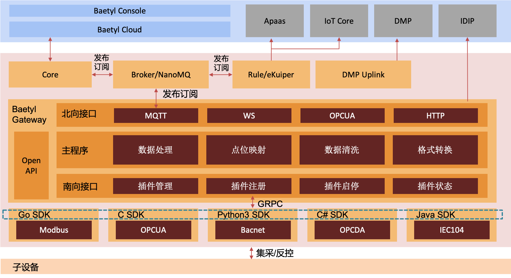
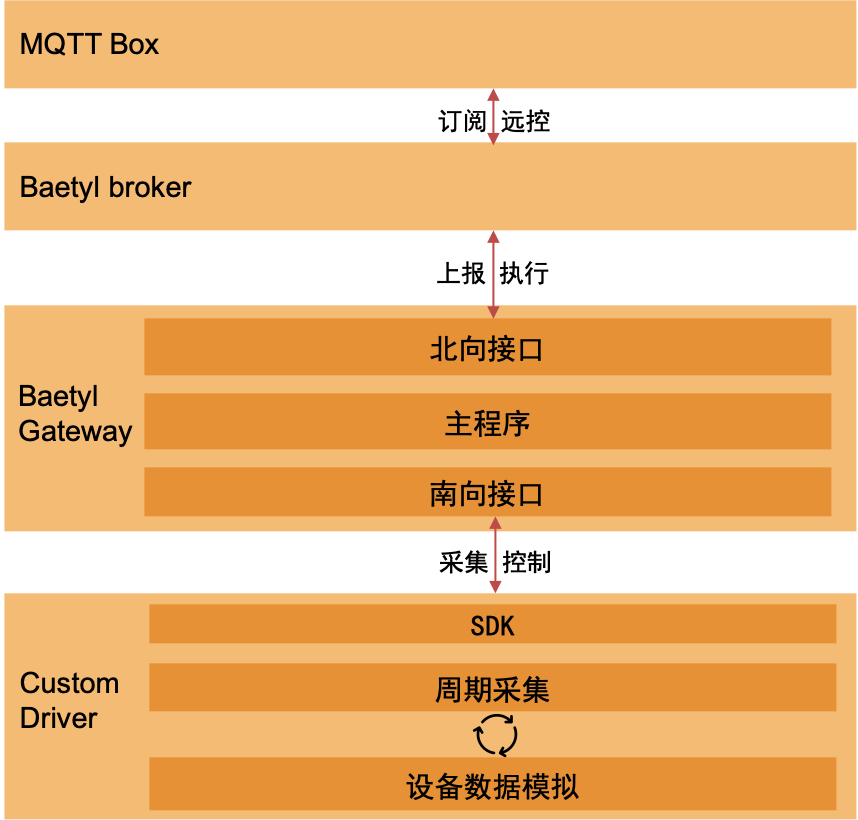

# BAETYL GATEWAY SDK
[](https://baetyl.io)

[](LICENSE)
[](Stars)

[English](./README.md)

Baetyl-Gateway 是基于 [go-plugin](https://github.com/hashicorp/go-plugin) 开源框架实现的 BIE 软网关。

旨在解决工业物联网领域中面临的海量异构设备数据难以统一接入的问题，此框架致力于将各种设备使用的不同通信协议数据转化为一致的物联网标准协议，从而实现设备与物联网系统之间的互联互通，为工业生产和制造过程提供全面的数据支持。

## 架构


### baetyl-gateway-sdk
baetyl-gateway-sdk 负责完成具体驱动与 baetyl-gateway 主进程的基础通信的封装

对应于架构图中蓝色虚线框部分

SDK 主要提供下面三部分功能
* 驱动协议实现时可以调用对应语言的 SDK 的接口完成数据的上报同步
* 通过实现 SDK 预定义的接口，可以将驱动托管给 baetyl-gateway 主进程，由主进程负责驱动的启停等操作
* 提供对 baetyl-gateway 框架下驱动的三个配置文件 access_template.yml、models.yml、sub_devices.yml 的解析逻辑的封装

## 文件结构
```
.
├── LICENSE
├── README.md
├── demo
│   ├── java
│   ├── golang
│   ├── python
│   ├── csharp
│   └── java
├── docs
├── sdk
│   ├── README.md
│   ├── example
│   ├── java
│   ├── golang
│   ├── python
│   ├── csharp
│   └── proto
└── test
    ├── baetyl-broker
    ├── baetyl-gateway
    └── driver
        ├── custom-java
        ├── custom-golang
        ├── custom-python
        └── custom-csharp
```
./sdk
* sdk/README.md: 通用的 SDK 开发指南  
* sdk/{language}: 目录下 java、golang、python、csharp 包含具体各语言 SDK 的实现
* sdk/proto: 定义软网关宿主服务和驱动服务支持的 rpc 函数列表，具体函数定义会在下文给出介绍
* sdk/example: 给出了 baetyl-gateway 框架下最终提供给驱动的三个配置文件的示例，具体示例内容会在下文给出介绍

./demo
* demo/{language}: 目录下 java、golang、python、csharp 包含、基于对应语言 SDK 的一个自定义驱动的 Demo 的实现，Demo 实现了对模拟三个点位的采集和上报过程

./test
* test/baetyl-broker: 目录下包含一个小型的 MQTT Broker 实现的二进制程序，用于帮助驱动的开发和调试工作，具体文件见 v0.0.0 Pre Release [baetyl-broker.tgz](https://github.com/baetyl/baetyl-gateway-sdk/releases/download/v0.0.0/baetyl-broker.tgz) 中
* test/baetyl-gateway: 目录下包含 baetyl 软网关的二进制程序，用于帮助驱动的开发和调试工作，具体文件见 v0.0.0 Pre Release [baetyl-gateway.tgz](https://github.com/baetyl/baetyl-gateway-sdk/releases/download/v0.0.0/baetyl-gateway.tgz) 中
* test/driver/custom-{language}: 提供个语言 Demo 二进制运行的配置文件，搭配上述工具可以运行软网关及开发的驱动

## SDK 开发
项目提供了若干语言的 SDK 实现

* [Golang SDK](./sdk/golang)
* [Java SDK](./sdk/java)
* [Python SDK](./sdk/python)
* [C# SDK](./sdk/csharp)

说明

* 源码可在项目对应目录下查看
* Release 中也提供了各语言 SDK 对应的产出，可直接按个语言依赖方式引入使用，具体产出文件和使用方式见各语言 SDK 目录下的 README.md

若需要自己从头实现一个 SDK 可以参考 [sdk/README.md](./sdk/README.md) 的说明进行开发

## 自定义驱动开发
项目提供了基于上述每种 SDK 的自定义驱动协议的实现

* [Golang Demo](./demo/golang)
* [Java Demo](./demo/java)
* [Python Demo](./demo/python)
* [C# Demo](./demo/csharp)

说明

* 源码可在项目对应目录下查看
* Release 中也提供了各语言 Demo 对应的产出，可直接进行测试使用，具体产出文件和使用方式见各语言 SDK 目录下的 README.md

若需要自己实现一个协议可以参考 [demo/README.md](./demo/README.md) 的说明进行开发

## 运行
参照前文架构，一个具体的驱动托管到 baetyl-gateway 来管控，最终驱动的集采数据同样由 baetyl-gateway 统一向外输出

在测试运行时，包含以下 4 个角色

* driver : 一个基于 SDK 实现的驱动实例，由 baetyl-gateway 来启停控制生命周期
* baetyl-gateway : 软网关主程序，纳管南向协议，处理集采数据，统一数据格式通过北向协议向上上报，当前测试场景中采用 MQTT 向上上报
* baetyl-broker : MQTT 消息中间件，提供 MQTT 消息订阅发布功能
* mqtt-client : 当前测试场景采用 MQTT Box（也可选用其他客户端程序或软件），用于发布和订阅消息

工作流如图所示：



具体各语言 Demo 运行方式见 [test/README.md](./test/README.md)

