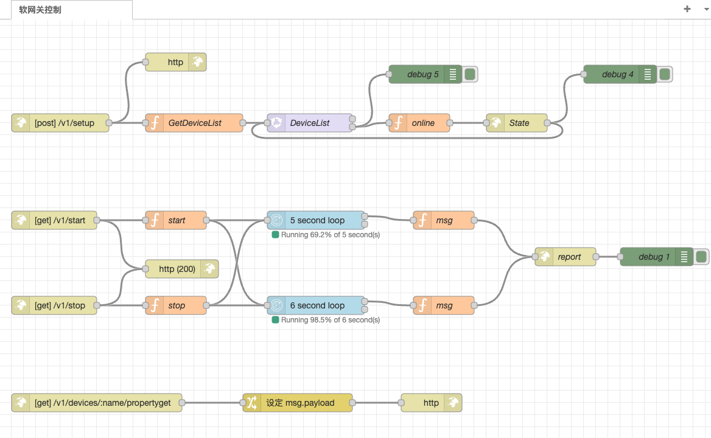

# Node-red 插件

## Node-red简介

[Node-red](https://github.com/node-red/node-red) 是一款使用nodejs开发的低代码开发平台，可以快速构建数据流。

其中，`flows.json` 文件为 node-red 的流程配置，在node-red中导入该文件，可以实现将node-red中的数据通过http的方式接入到该插件中。

修改其中的msg为你自己的采集流程，loop为你的上报周期，state及report的软网关上报地址，即可使用。



## 插件介绍

插件启动后，根据配置监听对应端口，提供如下接口

```shell
GET    /health   
POST   /v1/devices/:deviceName/report
POST   /v1/devices/:deviceName/state
```

其中 `/helath` 接口用于探测服务启动状态，正常时返回 http-code:200 , body: true

`/v1/devices/:deviceName/report` 用户接收数据的上报，body为键值对格式，键为string类型，值为任意类型
`/v1/devices/:deviceName/state` 用户接收设备的状态，body为键值对格式，键为"state"，值为状态true/false，

上报数据结构对应的 json 示例
```json
{
    "humidity": 68,
    "pressure": 11,
    "temperature": 49
}
```
