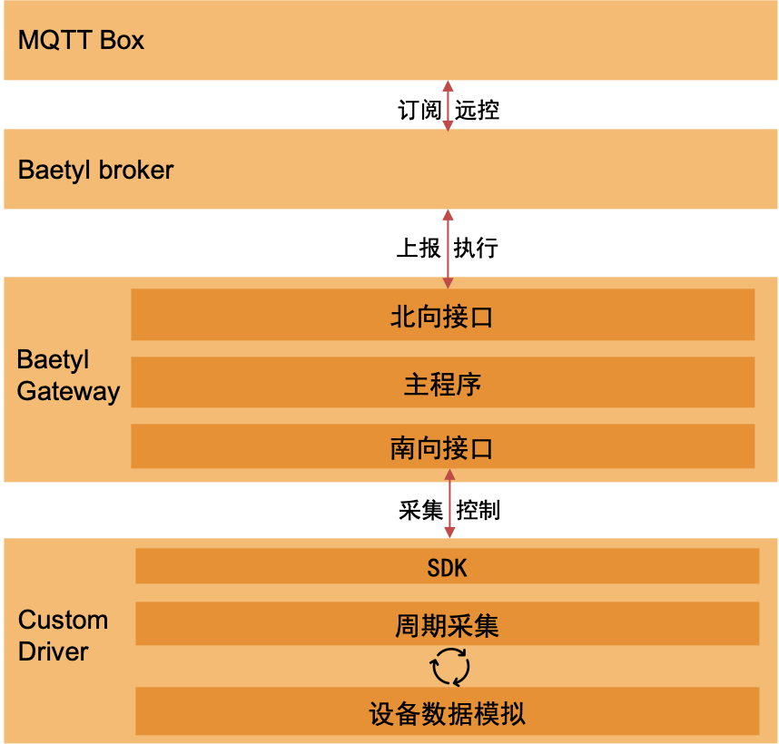

# 驱动运行
## 说明
一个具体的驱动托管到 baetyl-gateway 来管控，最终驱动的集采数据同样由 baetyl-gateway 统一向外输出

在测试运行时，包含以下 4 个角色

* driver : 一个基于 SDK 实现的驱动实例，由 baetyl-gateway 来启停控制生命周期
* baetyl-gateway : 软网关主程序，纳管南向协议，处理集采数据，统一数据格式通过北向协议向上上报，当前测试场景中采用 MQTT 向上上报
* baetyl-broker : MQTT 消息中间件，提供 MQTT 消息订阅发布功能
* mqtt-client : 当前测试场景采用 MQTT Box（也可选用其他客户端程序或软件），用于发布和订阅消息

工作流如图所示：



## 准备
### MQTT 客户端
详见 [MQTT_CLIENT](./MQTT_CLIENT.md)

### baetyl-gateway 主程序
提供 baetyl-gateway (git: a860495f)各平台的进程包，为 baetyl 软网关的二进制，用于协助开发调试，使用时可在项目 ./test/baetyl-gateway 下展开

[baetyl-broker.tgz](https://github.com/baetyl/baetyl-gateway-sdk/releases/download/v0.0.0/baetyl-broker.tgz)

### baetyl-broker 
提供 baetyl-broker 各平台的进程包，为 baetyl 实现的小型 MQTT 中间件，用于协助开发调试，使用时可在项目 ./test/baetyl-broker 下展开

[baetyl-gateway.tgz](https://github.com/baetyl/baetyl-gateway-sdk/releases/download/v0.0.0/baetyl-gateway.tgz)

### 各语言示例
提供各语言示例程序包

## 运行
下文以 java 示例为准进行介绍

环境信息：

* 系统：MacOS (Darwin)
* 架构: Arm64
* MQTT 客户端: MQTT Box

文件结构如下：

```
./test/
    ├── baetyl-broker
    │     ├── conf.yml
    │     ├── darwin
    │     │     └── arm64
    │     │         └── baetyl-broker
    │     │             └── baetyl-broker
    ├── baetyl-gateway
    │     ├── conf.yml
    │     ├── darwin
    │     │     └── arm64
    │     │         └── baetyl-gateway
    │     │             └── baetyl-gateway
    └── driver
        └── custom-java
            ├── access_template.yml
            ├── models.yml
            ├── program.yml
            ├── custom-java.jar
            └── sub_devices.yml
```

**!!! 工作目录：baetyl-gateway-sdk 项目根目录, 即 ./ **

**步骤 1** 

启动 broker

```shell
./test/baetyl-broker/darwin/arm64/baetyl-broker/baetyl-broker -c ./test/baetyl-broker/conf.yml 
```

其中 ./test/baetyl-broker/conf.yml 为 broker 的配置文件，更详细说明及源码见 [baetyl-broker](https://github.com/baetyl/baetyl-broker)

```yaml
listeners: # [必须]监听地址，例如：
  - address: tcp://0.0.0.0:8963 # tcp 连接
principals: # ACL 权限控制，支持账号密码和证书认证
  - username: test # 用户名
    password: hahaha # 密码
    permissions: # 权限控制
      - action: pub # pub 权限
        permit: ["#"] # 允许的 topic，支持通配符
      - action: sub # pub 权限
        permit: ["#"] # 允许的 topic，支持通配符
```

**步骤 2**

启动 MQTT 客户端并上述订阅 broker 的通用主题 `#`


</br>


**步骤 3**

配置并启动 baetyl-gateway

```shell
./test/baetyl-gateway/darwin/arm64/baetyl-gateway/baetyl-gateway -c ./test/baetyl-gateway/conf.yml
```

其中 ./test/baetyl-gateway/conf.yml 为软网关的配置文件

```yaml
plugin:
  drivers:  # 驱动列表
    - name: custom-java # 驱动名称
      binPath: "test/driver/custom-java"  # 驱动的执行入口 program.yml 所在目录，此字段后续也将替换 program.yaml 中的 ${PATH}  
      configPath: "test/driver/custom-java" # 驱动的配置文件所在目录，包含 access_template.yml、models.yml、sub_devices.yml 三个配置文件
server: # OpenAPI 服务配置
  port: ":9889" # OpenAPI 对外端口
mqttConfig: # 北向 MQTT Broker 连接配置
  address: mqtt://127.0.0.1:8963  # MQTT broker 地址
  cleansession: true 
  username: test  # 连接的用户名
  password: hahaha  # 连接的密码
```

**步骤 4**

MQTT Box 中查看设备采集数据

coustom-java 模拟了一个有三个测点的设备，设备测点值 10s 随机变化一次，驱动每 3s 采集上报一次


</br>


